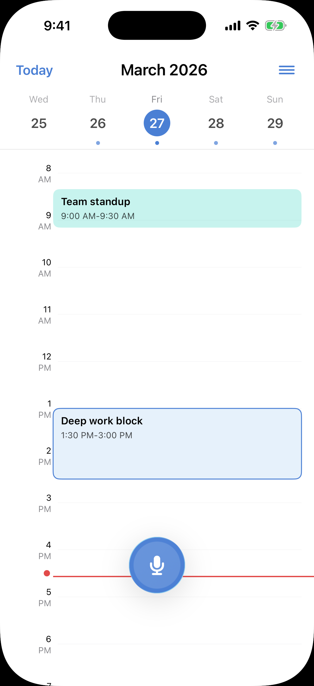
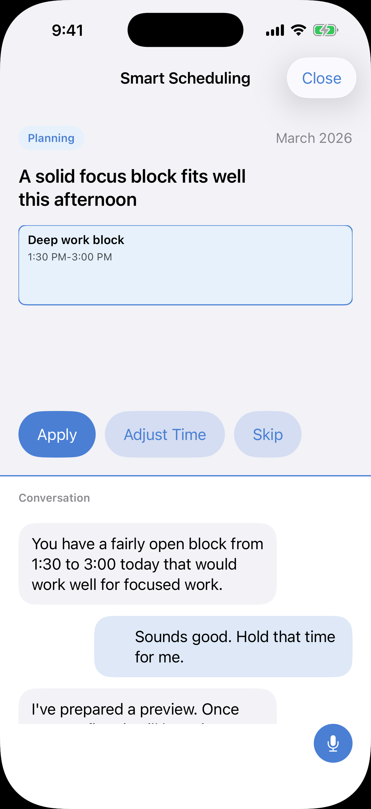

# CalPal

一个以隐私为核心、以本地 AI 为优先的 iPhone 日历助理。

CalPal 希望把一句简短的语音或文字输入，快速转成系统日历中的一个实际操作。Phase 1 聚焦最小可用闭环：

`语音 / 文字输入 -> 本地意图解析 -> EventKit 写入 -> 必要时确认`

## 预览

<p align="center">
  
  
</p>

<p align="center">
  <strong>Dashboard</strong> 展示以日历时间线为核心的主界面。
  <br />
  <strong>Smart Scheduling</strong> 展示把自然语言请求转成可执行日程建议的规划流程。
</p>

## 当前状态

这个仓库目前已经包含：

- 一个面向 Phase 1 的 SwiftUI iPhone 原型
- 真实 `EventKit` 日历读取 / 新增 / 修改 / 删除流程
- 基于 Speech Recognition 的按住说话输入
- 基于 Apple Foundation Models 的本地意图解析，以及本地 fallback 解析
- 中文 / 英文界面切换
- 通过 iOS 系统日历选择可写目标日历，包括系统已接入的 Google Calendar
- App 图标资源与配套设计 / 实现文档

## 为什么做 CalPal

很多 AI 日历产品要么默认把数据发到云端，要么更像一个聊天工具，而不是一个真正的日历。

CalPal 的方向不一样：

- 隐私优先
- 日历优先
- 语音优先
- 系统原生交互优先

它不是要替代 Apple Calendar，而是希望像“更聪明的系统日历”。

## Phase 1 范围

Phase 1 有意保持很小：

- 仅 iPhone
- 本地 AI 优先
- 基于 `EventKit` 使用 Apple 系统日历栈
- 聚焦快速输入、确认和写回

Phase 1 暂不包含：

- 云端 AI fallback
- 长期习惯学习
- iPad 专属体验
- 后端账号体系
- Android

## 当前架构

主要目录如下：

- `Views/`：SwiftUI 页面和组件
- `ViewModels/`：页面状态和流程编排
- `Services/`：EventKit、语音输入、权限、本地解析
- `Models/`：UI 模型和日历意图类型
- `Support/`：主题、布局、日期辅助

关键文件：

- `Calpal-Codex/Services/CalendarManager.swift`
- `Calpal-Codex/Services/VoiceInputManager.swift`
- `Calpal-Codex/Services/AIIntentParser.swift`
- `Calpal-Codex/ViewModels/CalendarScreenModel.swift`
- `Calpal-Codex/Views/Screens/MainCalendarScreen.swift`

## 日历源说明

CalPal 不直接调用 Google Calendar API。

它通过 Apple 的 `EventKit` 使用系统日历层。因此，只要设备已经在 iOS 的日历账户中接入 Google Calendar，CalPal 就可以通过系统层读取和写入这些日历。

现在设置页已经支持选择“默认写入日历”，所以新增事件可以明确写入：

- 系统默认日历
- iCloud 日历
- 通过 iOS 接入的 Google Calendar
- 其他可写系统日历源，例如 Exchange / CalDAV

## 语言支持

当前支持：

- 简体中文界面
- 英文界面

并且 onboarding 中选择的语言，会直接决定整个 app 的界面语言。

## 设计方向

目前的主输入交互围绕一个底部中央主按钮展开：

- 轻点：打开文字输入
- 长按：开始语音输入
- 按住拖动：按钮跟随手指移动
- 松手：结束录音并进入识别
- 识别开始后：按钮以弹簧动画回到中心

最近几轮也在持续打磨更接近 iOS 原生的动效手感，并在可用系统上探索 Liquid Glass 风格。

## 构建方式

打开 Xcode 工程：

```bash
open Calpal-Codex.xcodeproj
```

命令行构建：

```bash
xcodebuild -scheme Calpal-Codex -project Calpal-Codex.xcodeproj -sdk iphonesimulator -configuration Debug build
```

## 环境要求

- Xcode 26+
- iOS 26 模拟器或当前工程配置对应的兼容真机
- 若想体验最佳本地解析效果，建议在真机上开启 Apple Intelligence

## 文档入口

英文文档：

- [README](./README.md)
- [PRD](./CalPal_PRD_EN.md)
- [UI Spec](./CalPal_UI_SPEC_EN.md)
- [SwiftUI Guide](./CalPal_SwiftUI_Guide_EN.md)

中文文档：

- [README 中文版](./README_CN.md)
- [产品需求文档](./CalPal_PRD.md)
- [UI 设计规范](./CalPal_UI_SPEC.md)
- [SwiftUI 实现指南](./CalPal_SwiftUI_Guide.md)

## 开源说明

这个仓库正在整理为适合开源的形式。部分产品与设计文档最早使用中文撰写，现在正在逐步补齐英文版，方便外部协作。

## License

License 待补充。
